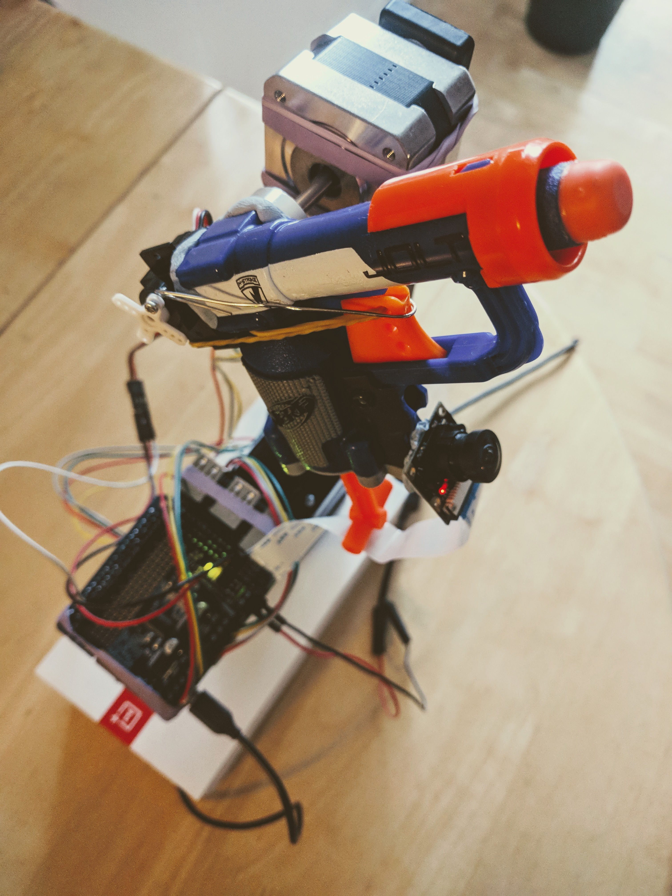
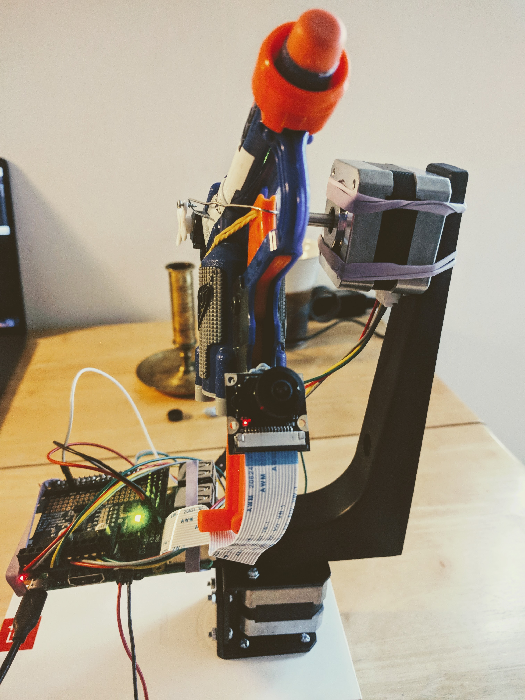
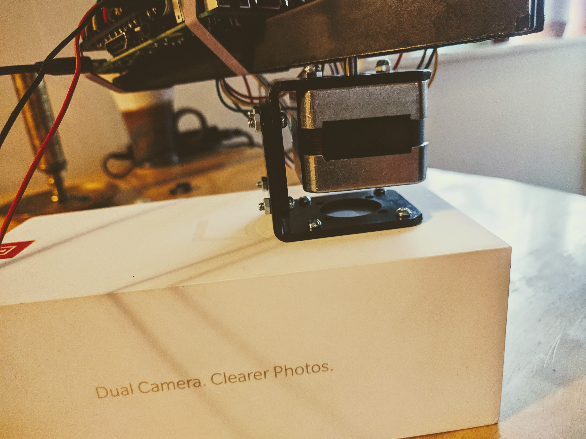
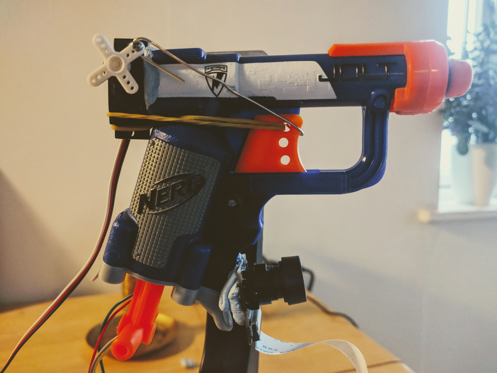

# Pi experiments


### Weathercock


Self-defense turret. Uses face detection and recognition to detect intruders and shoot them with a Nerf gun triggered by a servo motor.
See [this README](weathercock/README.md).

|               |               |
|:-------------:|:-------------:|
|  |  |
| Nerf gun | Fisheye camera |
|  |  |
| Base | Servo trigger |


### Programs


##### LCD screen


Pin connections as defined on [rototron](https://www.rototron.info/lcd-display-tutorial-for-raspberry-pi/).

```sh
make exec PROGRAM=lcd
```


##### Stepper motor

Enable I2C with `sudo raspi-config` and increase the I2C baudrate `dtparam=i2c_baudrate=1000000` in `/boot/config.txt`.
I also tried to add `options i2c_bcm2708 baudrate=1000000` to `/etc/modprobe.d/i2c.conf`:

For Nema-17 12V 350mA: red-grey-_blank_-yellow-green

```sh
# Simple demonstration program
make exec PROGRAM=motor

# Manual keyboard controller - should probably execute from a shell on the Pi though
make exec PROGRAM=motor_remote_control
```


##### Servo motor

May be a good idea to use a PWM controller to avoid jitter?
Meanwhile, connect _white_ to GPIO pin #18 and power/ground.

```sh
make exec PROGRAM=servo
```


##### Flex sensor

I adapted the pin connections from [raspberrypi-spy](https://www.raspberrypi-spy.co.uk/2013/10/analogue-sensors-on-the-raspberry-pi-using-an-mcp3008/).
I used a MCP3008 and a 10K resistor as well and it worked fine.

```sh
make exec PROGRAM=flex_sensor
```


##### Browser driver

I'm running Raspbian headless. So the selenium driver is installed as a pip dependency along virtual display:

```sh
pip install pyvirtualdisplay selenium
```
 
Firefox with Aptitude:

```sh
sudo apt-get install python-pip iceweasel xvfb
```

And GeckoDriver by hand and we want a version compatible with IceWeasel. Since currently IceWeasel is ~ Firefox v52, you
don't want to install GeckoDriver v0.19 which requires Firefox v55.

```sh
wget https://github.com/mozilla/geckodriver/releases/download/v0.16.1/geckodriver-v0.16.1-arm7hf.tar.gz
tar -zxvf geckodriver-v0.16.1-arm7hf.tar.gz
sudo mv geckodriver /usr/local/bin
rm geckodriver-v0.16.1-arm7hf.tar.gz
```

```sh
make exec PROGRAM=browser_driver
```


##### Blink LED


```sh
make exec PROGRAM=blink
```


##### Vibrate phone buzzer


```sh
make exec PROGRAM=vibrator
```


### Random


##### Power supply


The Pi may crash and restart unless it's got sufficient power. For the Pi3, 2.4A and 5.1V is good.


##### SD card images


Card to image:

```sh
sudo dd if=/dev/rdisk2 of=raspberry-opencv.dmg bs=1m
```

Image to card:

```sh
diskutil unmountDisk /dev/disk2
sudo newfs_msdos -F 16 /dev/disk2
sudo dd if=raspberry-opencv.dmg of=/dev/rdisk2 bs=1m
```

Notes:
- Usage of raw disk _rdisk2_ and block size of 1M to improve copy speed dramatically (10-15x)
- Use _Ctrl+T_ to show progress in the console


##### USB microphone


Check microphone connection:

```sh
lsusb
amixer
```

Record:

```sh
arecord -D plughw:1 --duration=10 -f cd -vv ~/rectest.wav
```

Play:

```sh
aplay ~/rectest.wav
# or
scp -r pi@pi2.local:~/rectest.wav .
open rectest.wav
```


##### Camera


Take a picture and check it:

```sh
raspistill -o ~/cam.jpg
scp -r pi@pi2.local:~/cam.jpg .
open cam.jpg
```


##### Raspberry Pi volume

```sh
alsamixer
```
